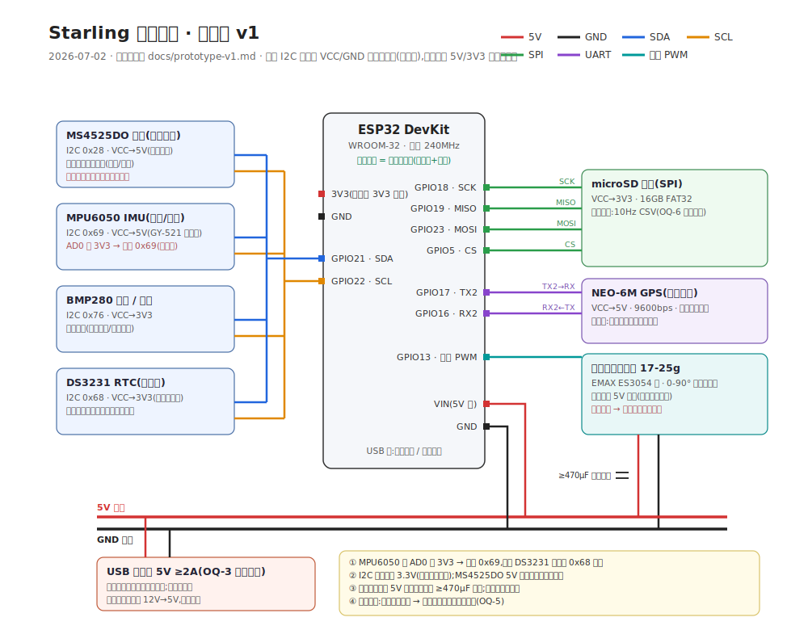

# Starling 原型一号规格(prototype v1)

> 2026-07-02 · 依据:charter §6 全部 OQ 裁决 + 本日硬件选型四拍板(见附录 A 决策记录)。
> **一句话**:一套台架上就能跑起来的最小实物——对皮托管来风,百叶像鳃一样张开;风停,弹簧把它合回齐平。

---

## 0. 目标与纵切片(第一周可观察)

原型一号**不追求装车**,追求"看得见地跑通全链":

```
迎面气流 → 皮托管 → MS4525DO 压差 → ESP32(阈值-斜坡曲线) → 舵机 → 连杆 → 多片百叶张合
                                    ↘ 传感器套餐 → microSD 日志(纯被动记录)
                                    ↘ USB / 蓝牙 → 配置与取数(不碰实时控制)
```

**成功判据(台架)**:
1. 对皮托管吹气(吹风机/骑车慢速手持),百叶随"风速"张开;停风后回到齐平闭合;
2. 拔电源,叶片被扭簧弹回闭合(失效保护实测);
3. SD 卡里有一段完整 CSV 日志(时间戳/压差/速度/开度/IMU/GPS);
4. 手机蓝牙或 USB 串口能改阈值参数并保存,重启后生效。

---

## 1. BOM 清单

| # | 类别 | 器件 | 关键规格 | 用途 | 参考价(¥) |
|---|---|---|---|---|---|
| 1 | 主控 | **ESP32 DevKit(WROOM-32)** | 双核 240MHz·内置蓝牙+WiFi·USB 串口 | 实时控制 + 配置口(蓝牙免外挂,OQ-7) | 25 |
| 2 | 测速 | **MS4525DO 空速计模块 + 皮托管套装** | 数字 I2C(0x28)·14 位·含皮托管与软管 | 皮托压差 → 速度(OQ-4) | 150~230 |
| 3 | 作动 | **17-25g 迷你金属齿数字舵机** | EMAX ES3054 级(17g/3.5kg·cm)或 JX 同级 | 单舵机连杆联动全部叶片(1 自由度) | 30~60 |
| 4 | 数据 | MPU6050 模块(GY-521) | I2C **0x69(AD0→3V3)** | 振动 / 姿态记录 | 6 |
| 5 | 数据 | BMP280 模块 | I2C 0x76·3V3 | 气温 / 气压(环境参照) | 5 |
| 6 | 数据 | DS3231 RTC 模块 | I2C 0x68·带纽扣电池 | 日志真实时间戳 | 8 |
| 7 | 数据 | microSD SPI 模块 + 16GB 卡 | 3.3V 直连型·FAT32 | 本地日志(OQ-6) | 15 |
| 8 | 数据 | NEO-6M GPS 模块(GY-GPS6MV2) | UART 9600·含天线 | 对地速度/轨迹(皮托标定参照) | 25 |
| 9 | 供电 | USB 充电宝 5V ≥2A | **选无小电流自动断电款** | 独立电池·零侵入(OQ-3 阶段一) | 已有/50 |
| 10 | 机构 | PETG/PLA 打印料 | PETG 优先(耐热日晒) | 固定框 / 叶片 / 摇臂 | 已有 |
| 11 | 机构 | 扭簧(小规格若干试配) | 回位力矩 ≤0.5kg·cm 级 | 断电弹回闭合(OQ-5) | 10 |
| 12 | 机构 | 连杆/销轴五金 | 1.5~2mm 钢丝拉杆·M2 螺丝·黄铜管轴套 | 叶片联动 | 20 |
| 13 | 电气杂项 | 杜邦线·XH2.54 接头·热缩管·≥470µF 电解电容·面包板 | — | 接线 | 20 |
| | | | | **合计** | **约 320~480** |

后期装车追加(本轮不买):12V→5V 降压带保险丝(取车电,OQ-3 阶段二)。

---

## 2. 接线



| ESP32 引脚 | 接 | 说明 |
|---|---|---|
| GPIO21 / GPIO22 | I2C SDA / SCL | 总线挂 MS4525DO(0x28)、MPU6050(0x69)、BMP280(0x76)、DS3231(0x68) |
| GPIO18/19/23/5 | microSD SCK/MISO/MOSI/CS | VSPI |
| GPIO17 / GPIO16 | GPS RX / TX(交叉) | UART2,9600bps |
| GPIO13 | 舵机信号 | LEDC 50Hz PWM |
| VIN / GND | 5V 主轨 / 共地 | 充电宝 USB 剥线或用 USB 分线板 |

**四条硬注意**(接错最常见的坑):
1. **MPU6050 的 AD0 必须接 3V3** → 地址变 0x69,否则与 DS3231 的固定地址 0x68 冲突,总线读乱;
2. MS4525DO 用 5V 供电,I2C 开漏、总线上拉 3.3V(模块自带上拉即可),与 ESP32 直连安全;
3. **舵机电源直取 5V 主轨**,不要走 ESP32 板载稳压(堵转瞬间电流会把主控拉复位),就近并 ≥470µF 电容;全系统共地;
4. 皮托管装在**车头迎风干净气流处**(台架阶段手持即可),动压/静压两根软管别接反(接反 = 读数永远为负,固件会视为 0)。

---

## 3. 供电预算

| 负载 | 典型 | 峰值 |
|---|---|---|
| ESP32(蓝牙开) | 120mA | 250mA |
| 舵机(17-25g 数字) | 10mA 静置 | 600~800mA 堵转瞬间 |
| GPS + 传感 + SD | 70mA | 120mA |
| **合计** | ~200mA | **<1.2A** |

5V/2A 充电宝裕量充足。**坑**:多数充电宝负载 <100mA 数分钟后自动断电——买标注"支持小电流/手环模式"的,或接一个小负载保活;断电不危险(弹簧回闭合),但日志会断。

---

## 4. 机构规格(3D 打印,下一步出 CAD)

- **固定框**:外框约 **120 × 70mm**、梯形/矩形 U 框(承全部风载),背面通透(charter §1③),框缘包住叶片边缘防哨音;带侧板安装耳。
- **叶片**:**4 片**,约 100 × 15mm,cambered 薄翼型截面(与 3D 演示一致),中轴销转动(威尼斯百叶式),两端黄铜管轴套。
- **联动**:每片叶带同长曲柄,一根钢丝拉杆串联全部曲柄,舵机摇臂驱动拉杆 = **1 个真实自由度**(OQ-M)。
- **行程**:**0°(竖直齐平闭合)→ 90°(水平全开)**;两端打印硬限位块,固件再叠软限位(双保险)。
- **失效保护**:扭簧装在其中一片叶轴上、预紧朝闭合方向;舵机通电顶开、断电松劲 → 弹簧带动整组连杆回闭合。弹簧回位力矩 ≤0.5kg·cm(舵机 3.5kg·cm 裕量 7 倍;先买几个小规格试配)。
- **材料**:台架 PLA 快速迭代;装车件换 **PETG**(耐热日晒)。
- **风载参考**:100km/h 动压 ~470Pa,4 片叶总受风面 ~0.006m² → 总力 ~3N,折算轴力矩 ~0.3kg·cm——舵机与簧都远够。

---

## 5. 固件设计(骨架见 [`firmware/starling/starling.ino`](../firmware/starling/starling.ino))

**状态机**:

```
BOOT(外设自检) → ZERO_CAL(静止 2s 压差零偏校准) → RUN(50Hz 控制环)
                                                     ↕(传感连续失败 25 次 / 恢复)
                                                    FAULT(舵机回 0° 闭合·继续日志·周期重试)
```

**控制律(每 20ms)**:压差 q(减零偏) → IAS = √(2q/1.225) → EMA 滤波 → **阈值-斜坡曲线 + 滞回**(v>V_ON 才起开;回落到 V_ON−HYST 以下才归零) → **限斜率**(SLEW°/s 防抖动) → **0~OPEN_MAX 硬限位** → 舵机脉宽。

**默认参数**(NVS 持久化,全部可经配置口改;数值待台架/路测标定,OQ-5):

| 参数 | 默认 | 含义 |
|---|---|---|
| V_ON | 20 km/h | 开始张开阈值 |
| V_FULL | 60 km/h | 全开速度 |
| HYST | 3 km/h | 关闭滞回 |
| OPEN_MAX | 90° | 全开角硬上限 |
| SLEW | 120°/s | 开度变化限斜率 |
| SERVO_US_0 / _90 | 1000/2000µs | 闭合/全开脉宽(装配后标定) |
| LOG_HZ | 10 | 日志频率 |

**日志**(microSD,CSV,10Hz):`ms, 日期时间(RTC), q_pa, ias_kmh, open_pct, servo_deg, ax/ay/az/gx/gy/gz, imu_temp, baro_pa, baro_temp, gps_fix/lat/lon/spd_kmh` —— 纯被动记录,不进控制闭环(OQ-6 边界)。

**配置口**(USB 串口与蓝牙 SPP 共用同一命令台,115200):`help / stat / get / set k v / save / cal / log on|off / test <deg> / reboot`。
**§3 边界锁死**:`test`(手动摆舵)**仅在 IAS < 5km/h 时接受**(纯台架用途);无 OTA;蓝牙仅配置+取数,任何"外部端实时控制开度"的功能一律不做。

---

## 6. 装配与验证步骤(按序,每步可观察)

1. **面包板电气链**:ESP32 + MS4525DO,串口打印 q 与 IAS,对皮托管吹气看数值 → 证测速链;
2. **加舵机**:吹气 → 舵机摆角随"风速"走曲线 → 证控制链(此时即是"翼面随输入张合"的最小纵切片);
3. **加齐传感套餐 + SD**:跑 10 分钟拿到完整 CSV → 证数据链;蓝牙/USB 改参数存取 → 证配置链;
4. **打印机构**:框+叶+连杆装配,手推顺滑无卡滞 → 挂舵机联动 → 挂扭簧,断电弹回实测;
5. **整机台架**:吹风机全链演示(= §0 成功判据);
6. 之后才谈装车:侧板安装耳适配、皮托走线、封闭场地试跑(OQ-10)。

---

## 7. 安全与失效(呼应 OQ-5 / OQ-10)

- 断电/固件跑飞 → 舵机松劲 → 扭簧弹回齐平闭合(静止态 = 最低阻、最低姿态);
- 机械硬限位 + 固件软限位双保险,叶片永不越 0~90° 行程;
- 无尖锐外缘,框缘包叶;装车阶段按 OQ-10 做当地车检自查与封闭场地验证。

---

## 附录 A · 硬件选型决策记录(2026-07-02,老方式一轮拍板)

| 议题 | 我的推荐 | owner 拍板 | 备注 |
|---|---|---|---|
| 主控 MCU | ESP32 DevKit | **ESP32 DevKit** ✓ | 内置蓝牙满足 OQ-7 免外挂 |
| 压差传感 | MPXV7002DP 模拟(便宜够用) | **MS4525DO 数字 I2C** ✗推荐被否 | owner 选数字件:免 ADC 噪声、低速端更稳(阈值点 ~20km/h 仅 ~19Pa) |
| 舵机 | MG90S → 追问中间档后荐 MG92B | **17-25g 迷你金属数字舵** | owner 主动要中间档(EMAX ES3054 级),买摩托振动环境耐久裕量 |
| 数据套餐 | 标准包(IMU+气压+RTC+SD) | **标准包 + GPS** | GPS 对地速度给皮托标定当参照,契合 OQ-6 R&D 数据集 |
